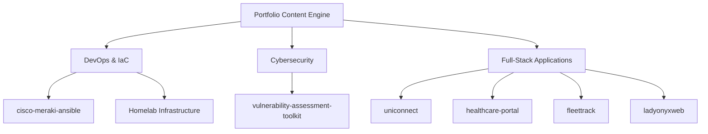

<div align="center">

# ⚡ Emmanuel Leon Isheanesu Chinjekure: Personal Portfolio & Infrastructure Showcase

[](https://nextjs.org/)
[](https://www.typescriptlang.org/)
[](https://tailwindcss.com/)
[](https://pnpm.io/)
[](https://elic01.dev)

<p align="center">
  <b>Full-Stack Developer · Systems Administrator · Cybersecurity Enthusiast</b><br/>
  Final-Year B.Tech IT Student at Harare Institute of Technology (HIT) · Former IT Intern at Cimas Health Group<br/>
  📍 Harare, Zimbabwe
</p>

[**🌐 Live Site (elic01.dev)**](https://elic01.dev) · [**👔 LinkedIn**](https://www.linkedin.com/in/emmanuel-l-i-chinjekure) · [**💻 GitHub**](https://github.com/elic01) · [**✉️ Email**](mailto:emmanuelisheanesu2004@gmail.com)

---

```text
  _____ _     ___ _____  _      ____   ___  ____ _____ _____ ___  _     ___ ___  
 | ____| |   |_ _| ____|/ \    |  _ \ / _ \|  _ |_   _|  ___/ _ \| |   |_ _/ _ \ 
 |  _| | |    | ||  _| / _ \   | |_) | | | | |_) || | | |_ | | | | |    | | | | |
 | |___| |___ | || |__/ ___ \  |  __/| |_| |  _ < | | |  _|| |_| | |___ | | |_| |
 |_____|_____|___|_____/_/   \_\_|    \___/|_| \_\|_| |_|   \___/|_____|___\___/ 
```

</div>

---

## 📖 Overview

**`elic-portfolio`** is a Next.js 16 web platform and engineering showcase built for **Emmanuel Leon Isheanesu Chinjekure (`@elic01`)**.

Rather than a static landing page, this application functions as a living laboratory and career architecture platform. Built on top of a strongly-typed content layer, it combines interactive cybersecurity tools, DevOps infrastructure visualizers, and responsive software design into a fast, accessible experience.

---

## 🔥 Key Highlights & Features

| Feature | Description | Tech Stack |
| :--- | :--- | :--- |
| **🚀 Typed Content Engine** | All data (projects, skills, career timeline, `/now` updates, changelog) is decoupled into typed TypeScript models in [`lib/content/`](file:///home/elic/Documents/Github/elic-portfolio/lib/content/types.ts). Updates require no JSX rewrites. | `TypeScript` `Zod` |
| **💻 Interactive Security Shell** | A client-side CLI terminal emulator (`/cybersecurity`) supporting real-time shell commands (`whoami`, `skills`, `tools`, `vuln-toolkit`, `sudo hire me`). | `React` `Framer Motion` |
| **⚙️ DevOps & Stack Diagrams** | Interactive visual diagrams (`/devops`) detailing self-hosted Proxmox VE hypervisors, Docker container stacks (Authentik SSO, Nextcloud, Gitea), and CI/CD pipelines. | `Framer Motion` `CSS Tokens` |
| **🎨 Premium Dark Aesthetic** | Engineered with custom HSL CSS variables, glassmorphism (`glass-panel`), neumorphic card depth (`neu-card`), and CRT scanline overlays. | `Tailwind CSS v4` `CSS Variables` |
| **🛡️ Validated Contact Form** | Client-side validated form with React Hook Form + Zod schema validation and anti-spam honeypot security. | `React Hook Form` `Zod` |
| **♿ Accessibility & SEO** | Semantic HTML5 tags, JSON-LD structured data (`Person` schema), and automatic `useReducedMotion` fallback hooks. | `Next.js SEO` `JSON-LD` |

---

## 🛠️ Technology Matrix

```text
┌─────────────────────────────────────────────────────────────────────────────┐
│                             ENGINEERING STACK                               │
├───────────────────┬───────────────────┬───────────────────┬─────────────────┤
│ Frontend Core     │ Styling & Motion  │ Security & DevOps │ Quality & Tools │
├───────────────────┼───────────────────┼───────────────────┼─────────────────┤
│ Next.js 16        │ Tailwind CSS v4   │ Proxmox VE        │ TypeScript 5.7  │
│ React 19          │ Framer Motion 12  │ Docker Compose    │ pnpm 10         │
│ App Router        │ Base UI           │ Authentik SSO     │ ESLint 9        │
│ Turbopack         │ Lucide Icons      │ Ansible / Python  │ Turbopack       │
└───────────────────┴───────────────────┴───────────────────┴─────────────────┘
```

---

## 📦 Featured GitHub Projects

The portfolio dynamically renders projects directly sourced from **[`github.com/elic01`](https://github.com/elic01)**:



### 🔒 Cybersecurity & DevOps
1. **[Homelab Infrastructure & Self-Hosting](https://github.com/elic01)**  
   *Proxmox VE virtualization cluster hosting Nextcloud, Paperless-ngx, and Gitea via Docker Compose, backed by PostgreSQL, Redis, and Authentik SSO.*
2. **[`cisco-meraki-ansible`](https://github.com/elic01/cisco-meraki-ansible)**  
   *Infrastructure-as-Code (IaC) playbooks for automated provisioning and security policy management across Cisco Meraki enterprise networks.*
3. **[`vulnerability-assessment-toolkit`](https://github.com/elic01/vulnerability-assessment-toolkit)**  
   *Automated security auditing shell toolkit for rapid port scanning, service reconnaissance, and attack surface assessment.*

### 💻 Full-Stack Development
4. **[`healthcare-portal`](https://github.com/elic01/healthcare-portal)**  
   *Comprehensive web portal for managing clinical workflows and patient records in health IT environments.*
5. **[`uniconnect`](https://github.com/elic01/uniconnect)**  
   *Full-stack student feedback platform built with Next.js, Firebase Auth, and Firestore real-time database.*
6. **[`fleettrack`](https://github.com/elic01/fleettrack)**  
   *Full-stack vehicle telematics, route tracking, and maintenance management application.*

---

## 💻 Interactive Shell Reference (`/cybersecurity`)

Users can interact with the embedded security CLI using the following terminal commands:

```bash
elic@security:~$ help

Available commands:
  whoami          : display background and role
  skills          : list technical skills across stack
  tools           : list security & infrastructure tools
  vuln-toolkit    : view Vulnerability Assessment Toolkit info
  certifications  : list current pursuits & credentials
  contact         : how to reach Emmanuel
  clear           : clear terminal screen
  sudo hire me    : trigger secure recruiter communication channel
```

---

## 📁 Directory Architecture

```text
elic-portfolio/
├── app/                        # Next.js App Router pages
│   ├── page.tsx                # Hero, About, Featured Work, Skills & Timeline
│   ├── projects/               # Project portfolio & deep dives
│   ├── cybersecurity/          # Security focus areas, Vulnerability Toolkit & Shell
│   ├── devops/                 # Homelab visualizer, stack & pipeline diagrams
│   ├── now/                    # August 2026 status & learning log
│   ├── contact/                # Validated contact form
│   ├── changelog/              # Career & application revision history
│   ├── globals.css             # Theme tokens, utilities & scanline overlays
│   └── layout.tsx              # Root layout, fonts & JSON-LD schema
├── components/                 # React UI components
│   ├── cybersecurity/          # Interactive CLI shell & BIOS boot animation
│   ├── devops/                 # CI/CD pipeline & stack visualizer components
│   ├── home/                   # Hero, about, skills preview & timeline sections
│   ├── projects/               # Detailed project cards & tech badges
│   └── ui/                     # Base UI primitive components (Button, etc.)
├── lib/                        # Core application utilities
│   ├── content/                # Strongly-typed content data layer
│   │   ├── profile.ts          # Profile details, bio & role status
│   │   ├── projects.ts         # Portfolio projects list (GitHub repos)
│   │   ├── skills.ts           # Technical skill categories & proficiency
│   │   ├── experience.ts       # Work experience & internship history
│   │   ├── education.ts        # Degree & organization affiliations
│   │   ├── site.ts             # /now log & site changelog entries
│   │   └── types.ts            # TypeScript interfaces
│   └── utils.ts                # Tailwind class merger utility
├── eslint.config.mjs           # ESLint 9 Flat Config setup
├── package.json                # Project dependencies & scripts
└── README.md                   # Project documentation
```

---

## 🚀 Getting Started

### Prerequisites

Ensure you have **Node.js (v20+)** and **`pnpm`** installed:

```bash
corepack enable
```

### Installation & Setup

1. **Clone the repository**:
   ```bash
   git clone https://github.com/elic01/elic-portfolio.git
   cd elic-portfolio
   ```

2. **Install dependencies**:
   ```bash
   pnpm install
   ```

3. **Run local development server**:
   ```bash
   pnpm dev
   ```
   Open **`http://localhost:3000`** in your browser.

---

## 🧪 Verification & Build Commands

Maintain code quality and verify builds using the following commands:

| Command | Action |
| :--- | :--- |
| **`pnpm dev`** | Starts Next.js development server with Turbopack |
| **`pnpm run lint`** | Runs ESLint 9 flat-config check across all `.ts`/`.tsx` files |
| **`npx tsc --noEmit`** | Performs strict TypeScript compiler type verification |
| **`pnpm run build`** | Compiles production static page assets (`out/`) |
| **`pnpm start`** | Runs the production server build locally |

---

## 📬 Contact & Connect

<div align="center">

**Emmanuel Leon Isheanesu Chinjekure**  
*Harare, Zimbabwe*

[](https://github.com/elic01)
[](https://www.linkedin.com/in/emmanuel-l-i-chinjekure)
[](mailto:emmanuelisheanesu2004@gmail.com)

</div>
